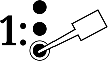
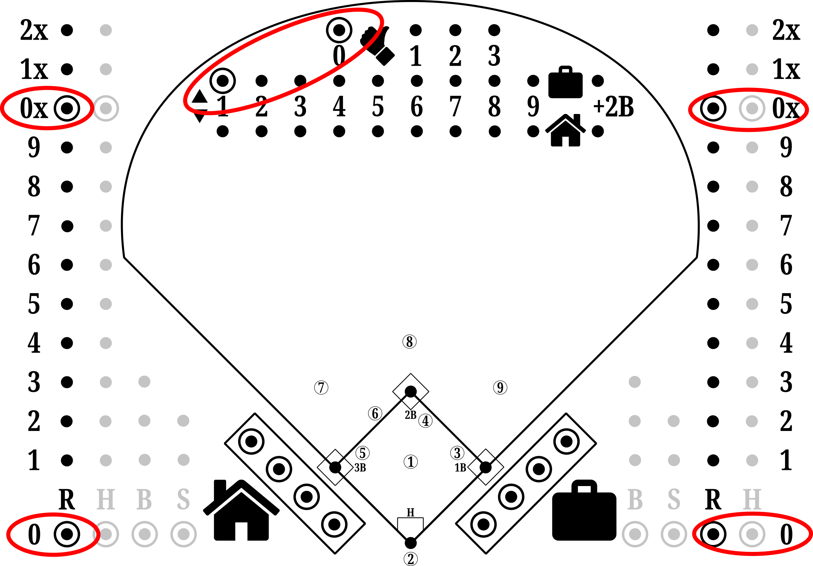
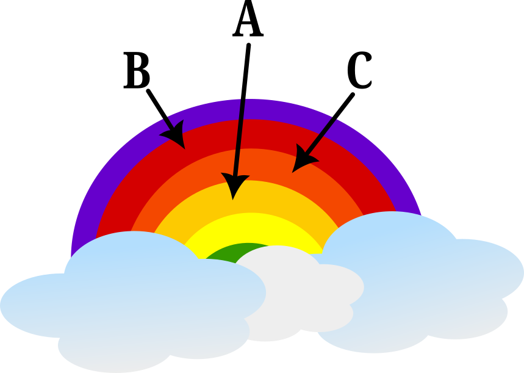
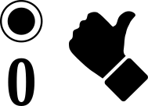
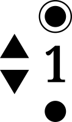
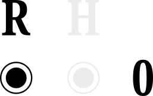
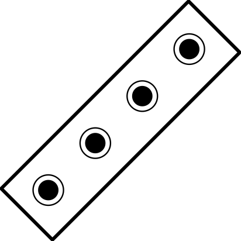
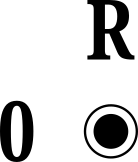
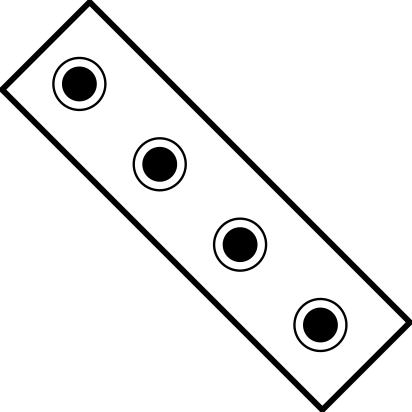

Copyright © Crane Softwrights Ltd.
[https://GitHub.com/CraneSoftwrights/board-baseball](https://GitHub.com/CraneSoftwrights/board-baseball)  
[https://GitHub.com/CraneSoftwrights/board-baseball/blob/main/shared/Z-SETUP.md](https://GitHub.com/CraneSoftwrights/board-baseball/blob/main/shared/Z-SETUP.md)  
[https://GitHub.com/CraneSoftwrights/board-baseball/blob/main/shared/Z-SETUP.html](https://GitHub.com/CraneSoftwrights/board-baseball/blob/main/shared/Z-SETUP.html)  

#  

  

 [14 x A](Z-SETUP.md#14-x-a) / [2 x A, 6 x B, 6 x C](Z-SETUP.md#2-x-a-6-x-b-6-x-c)

## 14 x A

| |A|
| :---: | :---: |
| |  |
| |  |
|  | 
| | 
| | 
| : | 
| | 
| | 

## 2 x A, 6 x B, 6 x C

|A|B|C|
| :---: | :---: | :---:
| |  | 
|  |  | 
|  |  | 
| |  | 

